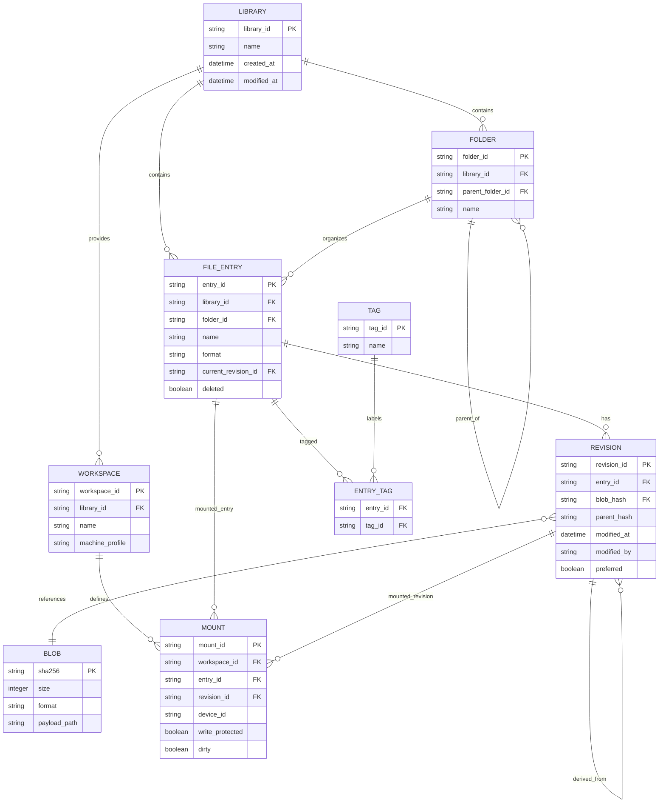

# Full Library Management

Status: design proposal; no implementation has been started.

Date: 2026-10-08

## Purpose

The disk library should support moving a complete working library between
browsers, computers, and the native application without requiring the user to
download and re-import every ATR or XEX file individually.

The exported library must include the binary content and the information that
makes the collection useful as a working Atari setup: folders, metadata,
working copies, modification times, revisions, and disk assignments such as
`atariwriter.atr` in `D1:` and `docs.atr` in `D2:`.

This document records the library model and the user experience discussed for
the future implementation. It is intentionally a design document; it does not
authorize or describe an implementation in the current change.

## Project parity

Every new capability in this project must be implemented and tested in both
`jsA8E` and native A8E. Platform-specific storage and UI adapters are allowed,
but the applications must preserve:

- compatible export and import manifests;
- compatible library, revision, and mount semantics;
- equivalent user-visible behavior;
- matching regression fixtures for package validation and conflict handling.

The feature is incomplete while it exists in only one application.

## Interchange format decision

`library.json` is the canonical interchange contract for the library in both
applications. `jsA8E` and native A8E must be able to export and import the same
schema without conversion through an application-specific format.

The JSON file contains metadata, folders, entries, revisions, hashes, and
workspace/mount information. Binary ATR and XEX content is stored as
content-addressed payloads referenced by SHA-256. A complete portable package
therefore contains `library.json` plus the referenced binary files.

```text
a8e-library-export/
├── library.json
└── blobs/
    ├── <sha256>.atr
    └── <sha256>.xex
```

This keeps the library format JSON-based and interchangeable while avoiding
the size and memory cost of embedding every binary as Base64. A self-contained
JSON-with-Base64 variant may be supported later for small diagnostic exports,
but it is not the canonical format for full libraries.

The native A8E library directory should use the same structure, so its local
metadata file is also `library.json`. The browser may keep the same logical
records in IndexedDB, but its import/export adapter must produce and consume
the identical JSON schema.

The manifest carries two different version values:

- `schemaVersion` identifies the structure and rules of `library.json` and
  changes only when the interchange format changes;
- `libraryVersion` is a monotonically increasing revision of the library state
  and increments whenever the persisted library or workspace is modified.

An older `jsA8E` or A8E that detects a package with a higher
`libraryVersion` must show a warning popup and still attempt the import. If the
package uses an unsupported higher `schemaVersion`, it must also warn and make
the same best-effort attempt. Any validation or migration failure must abort
the import transaction and show a popup explaining the failure; partial data
must not become visible.

An older application must not silently export a newer library in a way that
loses unknown fields or revisions. If downgrade data loss is possible, the
export must be blocked or require an explicit confirmation.

### Frozen schema v1 decision

The first implementation freezes `library.json` at `schemaVersion: 1`. The
initial implementation must complete and test this schema before adding new
required fields or changing the meaning of existing fields. Additive optional
fields are allowed only when older readers can safely ignore them and the
compatibility warning rules remain effective.

Any incompatible structural change requires a new schema version and an
explicit migration design. It must not be introduced into schema v1 through
an unannounced field rename or semantic change.

## Library operations

The library should expose two related operations:

### Download full library

Exports every library entry, its metadata, and the binary payload needed to
reconstruct the library in another browser or computer. For writable ATR
images, the payload must be the current working copy, after pending emulator
changes have been flushed.

The export should preserve, when present:

- stable library entry identifiers;
- names, formats, folders, tags, and descriptions;
- preferred/current revisions and retained conflict revisions;
- binary content for ATR and XEX files;
- creation and modification timestamps;
- the current `D1:` through `D8:` assignments;
- write-protection state and dirty/working-copy state;
- optional workspace and machine settings.

### Load full library

Imports one complete package and validates it before changing local storage.
The operation must not replace the local library until all manifest records and
binary payloads have passed validation.

Import should detect existing entries by stable ID and content hash, preserve
local content, and apply the default revision policy described below. The
workspace mount map should be restored only after all referenced artifacts are
available.

The import result should summarize added entries, already-present entries,
duplicates, renamed collisions, restored mounts, and conflicts requiring user
attention.

## Full library versus workspace export

These are separate scopes built on the same package format:

- **Full library export:** all library entries and the revisions selected by
  the export policy. This is intended for backup and migration.
- **Workspace export:** only the artifacts required by the current setup,
  including mounted disks, selected XEX files, current writable copies, mount
  assignments, and write protection. This is intended for moving a specific
  AtariWriter-style session.

The workspace export must support the example where the two mounted ATR files
and their latest document changes are transferred together. A later remote
repository can use this same content-addressed package model, but online
synchronization is outside this first subproject.

## Package format

The preferred portable artifact is one file containing `library.json` and its
binary payloads:

```text
a8e-library-export/
├── library.json
├── blobs/
│   ├── <sha256>.atr
│   └── <sha256>.xex
└── hostfs/
    └── ...
```

The browser should offer a single download such as
`a8e-library-export.zip` or `workspace.a8e`, and a single file picker for
loading it.

The `.a8e` format is explicitly a standard ZIP archive with an A8E-specific
extension. It is not an executable or a proprietary binary container. A valid
`.a8e` package must contain `library.json` and may contain `blobs/`, `hostfs/`,
and other versioned directories defined by the schema. Renaming `.a8e` to
`.zip` must make the archive inspectable with ordinary ZIP tools.

The package must not rely on Base64-encoded binaries inside JSON as its primary
representation: that increases size and creates avoidable large temporary
strings. `library.json` remains human-readable and is the shared contract for
both applications.

### Initial ZIP implementation

The first `.a8e` implementation will use a valid ZIP archive with uncompressed
entries (`compression method 0`). The ZIP reader/writer will be implemented in
the project for both `jsA8E` and native A8E, without requiring an external
runtime dependency.

The initial ZIP subset must support UTF-8 entry names, CRC-32, local file
headers, the central directory, and the end-of-central-directory record. It
will initially reject encrypted entries, unsafe paths, unsupported compression
methods, and ZIP64 packages. A package-size limit below 4 GiB is acceptable for
the first version.

This produces a larger package than a compressed archive, but keeps the
interchange path simple, portable, offline-capable, and behaviorally aligned
between both applications. Ordinary ZIP tools must still be able to inspect
and extract the resulting `.a8e` file.

After the uncompressed implementation is stable, the project may adopt an
open-source compression library or add DEFLATE support. Any selected library
must be compatible with GPLv2, preserve its license notices, and be available
to both applications without creating a browser-only or native-only package
variant. Compression is an optimization and must not become a prerequisite for
interchange compatibility.

The package must be validated for:

- schema version and required fields;
- supported ATR/XEX type;
- payload size and configured size limits;
- SHA-256 content hash;
- valid ATR/XEX structure;
- safe relative paths with no traversal;
- mount references that point to package entries.

Authentication tokens, passwords, browser paths, and repository credentials
must never be included.

## Manifest outline

The following is illustrative rather than a final schema:

```json
{
  "format": "a8e-library-export",
  "schemaVersion": 1,
  "libraryVersion": 42,
  "createdAt": "2026-10-08T15:00:00Z",
  "library": [
    {
      "id": "disk-documents",
      "name": "docs.atr",
      "folderId": "folder-projects",
      "type": "atr",
      "path": "blobs/4a92...atr",
      "size": 92176,
      "sha256": "4a92...",
      "createdAt": "2026-10-01T12:00:00Z",
      "modifiedAt": "2026-10-08T14:45:12Z",
      "preferredRevisionId": "rev-002"
    }
  ],
  "workspace": {
    "devices": {
      "D1": "disk-atariwriter",
      "D2": "disk-documents"
    },
    "writeProtected": {
      "D1": false,
      "D2": false
    }
  }
}
```

`D1:` through `D8:` are the supported disk device slots. The manifest should
remain extensible for HostFS, cassette, and other pluggable devices without
making those devices mandatory for a disk-only import.

## Identity, dates, and revisions

Filenames are display names, not identities. Each binary revision should have
a SHA-256 hash. Stable library IDs identify logical entries; hashes identify
exact content.

Store timestamps as UTC ISO 8601 values and keep these meanings distinct:

- `createdAt`: entry or revision creation;
- `modifiedAt`: last binary-content change;
- `lastMountedAt`: last mount operation;
- `lastExportedAt`: last inclusion in an export.

Browsing, mounting, and exporting must not make a file appear modified. A
writable ATR becomes dirty when its emulated content changes, and the current
bytes plus `modifiedAt` must be flushed before export.

A revision may contain:

```json
{
  "revisionId": "rev-002",
  "parentHash": "sha256:base",
  "sha256": "sha256:browser-a",
  "modifiedAt": "2026-10-08T14:45:12Z",
  "modifiedBy": "browser-a"
}
```

The default policy is **keep newest with history**:

- equal hashes are the same content and do not conflict;
- a descendant revision is preferred over its ancestor;
- concurrent revisions are both retained;
- when concurrent timestamps differ, the newest is preferred by default;
- equal or unreliable timestamps use deterministic revision/hash ordering;
- the non-preferred revision remains available as history or a conflict copy.

This permits recovery when the same disk was modified in two browsers. It is
not destructive last-write-wins behavior.

## File-system model

The logical library is organized into folders. The initial visual design does
not require a tree navigator: the current folder and `..` are sufficient for
navigation. The underlying model nevertheless supports nested folders and
stable IDs.



Important invariants:

- each mount device is one of `D1:` through `D8:`;
- one workspace cannot mount the same logical library entry in two devices at
  the same time;
- a mount identifies the logical entry and the selected revision, not only a
  content hash;
- deletion must be guarded when an entry is mounted or has unsaved changes;
- downloading a file exports its current working-copy bytes;
- imported copies with different stable IDs remain distinct even when their
  display names match.

## Library user interface

The proposed browser and native library views follow a compact
Midnight-Commander-style panel rather than a tree-and-details layout.

In native A8E, this view is a floating Library window. It provides the same
operations and layout as the `jsA8E` Disk Library panel, while using the native
library directory and the shared `library.json` contract underneath.

### Navigation panel

- show the contents of the current folder;
- provide `..` to move to the parent folder;
- use folder icons for folders;
- show `ATR` and `XEX` type tags for files;
- omit the separate details pane for now;
- keep the current path visible in the panel header.

Each file row should provide:

- the file name and type tag;
- an `RW` column containing only a small `*`: red for read-only and green for
  writable;
- mount controls for `D1:` through `D8:`;
- a `Download` action for that file's current bytes;
- a `Delete` action with the safety rules below.

The `RW` marker describes the effective media mode. A write-protected mount
must appear red even when the underlying ATR has writable structure. The
marker is separate from both the live SIO activity asterisk and the
persistent `dirty` state.

### Upload and drag-and-drop

The navigation panel should provide an `Upload` button and accept file drops.
Both paths have the same behavior:

- accept supported ATR and XEX files;
- add each delivered file to the folder currently open in the navigation
  panel;
- preserve the original filename, format, and upload timestamp;
- validate the file structure and content before making it visible;
- calculate its SHA-256 content identity during ingestion;
- initialize a writable ATR working copy from the uploaded bytes;
- report rejected, duplicate, and successfully added files in the panel status
  area.

The current folder is part of the operation's context. Changing folders before
the operation starts changes the destination; a file must not silently be
placed in the library root merely because the upload originated from a global
toolbar.

When a name already exists in the current folder, the UI should offer an
explicit choice such as replace/create a renamed copy/cancel. Replacement must
follow the normal revision and working-copy rules and must never silently
discard a local dirty copy. Files with the same name in different folders are
allowed.

The first implementation accepts files, not recursive directory drops. A
future directory-drop enhancement may preserve a relative folder hierarchy,
but it must use the same folder IDs and validation rules as ordinary uploads.

### Folder and entry organization

The initial library implementation must allow users to create, rename, and
move folders. It should also allow renaming and moving library entries while
preserving their stable IDs, revisions, timestamps, tags, and mount identity.

Moving an entry that is mounted must update its displayed path without
changing the active device assignment. Moving or renaming a dirty entry must
not discard its working copy. Name collisions in the destination folder must
offer an explicit rename, replace, or cancel choice and must follow the normal
revision/conflict rules.

### ATR contents view

Clicking or opening an ATR should reuse the same library panel while changing
its list view from library navigation to the contents of the selected disk
image. It should not require a second permanent details pane or a separate
application window.

The panel header should show the context and provide a way back, for example:

```text
Library / Projects / docs.atr
[Back] [ATR info] [Download image]
```

For a recognized Atari filesystem, the contents view should initially provide
a read-only directory listing with entries such as:

```text
README.TXT    12 sectors
LETTER.DOC    48 sectors
INDEX.DAT      3 sectors
```

The first filesystem targets are DOS 2.x and MyDOS. Selecting an internal file
may later open a text/hexadecimal preview or offer a file download. The view
must preserve the parent library folder and return to it through `Back` or
`..`.

If the ATR is a boot disk, game disk, XEX-converted image, or another image
whose filesystem is not recognized, the same panel should show the ATR header
and sector geometry and offer a raw sector/hexadecimal view instead of
pretending that the image contains a normal directory.

Filesystem inspection is read-only in the first phase. Editing, importing, or
deleting files inside an ATR requires separate support for the relevant DOS
directory, VTOC, allocation, density, and protection rules. The view and its
recognized-format results must remain behaviorally aligned between `jsA8E` and
the native A8E floating Library window.

### Initial ATR viewer scope decision

The first ATR viewer is intentionally limited to a read-only inspection path:

- ATR header and sector geometry;
- filesystem detection for DOS 2.x and MyDOS;
- directory listing for recognized images;
- individual-file extraction/download;
- ATASCII-aware text preview and hexadecimal fallback;
- explicit raw-sector view for unrecognized or custom images.

The first viewer will not edit, import, delete, repair, or reallocate files
inside an ATR. Those operations remain later projects because they require
filesystem-specific VTOC, directory, allocation, density, and protection
rules. This scope applies equally to `jsA8E` and the native A8E floating
Library window.

### Internal file extraction and ATASCII preview

The contents view should support downloading an individual file from a
recognized ATR without downloading the complete disk image. The extracted file
must retain its Atari filename where possible and use the file's detected type
for its download name.

Text files should offer an ATASCII-aware preview and an optional conversion to
modern text. The original bytes must remain available for download, and bytes
that do not map cleanly to modern text must not be silently discarded. Binary
files should fall back to a hexadecimal preview.

Importing, replacing, or deleting internal files is a later write-enabled
feature and must follow the image's DOS allocation, VTOC, directory, density,
and write-protection rules.

### Filesystem detection and status bar

The ATR viewer should identify the filesystem when possible, initially
including DOS 2.x and MyDOS and later allowing additional filesystem adapters.
The detected type must appear in the panel status bar, for example:

```text
Filesystem: MyDOS  |  720 sectors  |  Read-only inspection
```

For an unrecognized boot, game, XEX-converted, or custom image, the status bar
must say so explicitly and show the ATR geometry rather than presenting an
inferred directory as authoritative. The selected internal file's detected
type may also be shown in the same status area.

### Integrity verification and repair

The library should provide a diagnostic verification action for ATR entries.
It should detect malformed ATR headers, invalid sector ranges, inconsistent
VTOC/directory allocation, and payload/hash mismatches. The first repair mode
is diagnostic only: it reports findings and never changes the image.

Any future repair operation must require explicit confirmation, create or
retain a recoverable revision first, and be unavailable while the image is
mounted read/write unless the working-copy transition is clearly controlled.

### Interactive library search

The panel should place a search field immediately above the status bar. Search
is interactive: results update while the user types, without requiring a
submit button.

The initial search behavior is:

- search all library files by default;
- match the query anywhere in the filename, not only from the beginning;
- ignore letter case;
- show an empty query as the normal current-folder view;
- present non-empty results as a virtual folder in the file list;
- preserve the normal mount, Download, Delete, and open-ATR controls on each
  result;
- show the original folder path for each result so a match is not ambiguous.

For example, typing `ezum` must return `Montezuma`. Selecting a result must
allow the user to mount its image immediately without first navigating back to
its physical folder. The virtual search view is a presentation state only; it
must not create or move library entries.

### Status bar and revision information

The panel status bar should also expose the active revision information for the
selected file or current ATR view, including when available:

- active revision identifier;
- revision count;
- last modification time;
- conflict/history indicator;
- detected filesystem or internal file type;
- current read-only/writable state.

For example:

```text
Revision rev-002  |  3 revisions  |  Modified 2026-10-08 14:45 UTC  |  MyDOS
```

The status bar must remain concise and should summarize multiple selected files
instead of creating a separate details pane.

### Mounted-devices panel

A persistent panel above the navigation list should show, for every occupied
device:

- device name (`D1:`–`D8:`);
- mounted folder/file path;
- the logical library entry and active revision when useful;
- write-protection and dirty indicators;
- a small media-activity asterisk next to the mounted image;
- an `Unmount` action.

When a row's mount button changes, this panel must update immediately after the
operation completes. The panel is the authoritative visual answer to “what is
mounted where?” when files are distributed across different folders.

### Media activity indicator

The mounted-devices panel should reuse the library's small asterisk activity
indicator next to each mounted image:

- blink or pulse in **green** while the emulated device is reading that image;
- blink or pulse in **yellow** while the emulated device is writing that image;
- remain hidden or inactive when no media operation is in progress.

The indicator represents live I/O activity, not merely that an image is
mounted. It must be driven by the same SIO read/write events in both `jsA8E`
and native A8E, so the color reflects the operation actually performed by the
emulated device. A write must also continue to update the separate persistent
`dirty` state used to indicate unsaved working-copy changes; the activity
asterisk and the dirty marker must not be conflated.

If read and write activity overlap, the write state takes priority visually.
The indicator should have a short minimum visible/pulse duration so very fast
operations remain perceptible, while not delaying emulation or SIO timing.

### Mount exclusivity

The same logical library entry may not be mounted in two devices at once. If a
user selects another device for an already mounted entry, the UI should offer
to move it, with `save`, `discard`, or `cancel` when there are pending changes.
This rule preserves physical-media realism. Separate imported entries with
different stable IDs may still represent separate media, even if their bytes
currently have the same hash.

### File actions

`Download` exports the current working copy, not a stale original upload. For
an XEX that has been converted to a writable runtime disk image, the action
must clearly identify the resulting format/name.

`Delete` must be recoverable where practical, or at minimum guarded by a
confirmation. If the file is mounted or dirty, the user must be offered a
safe choice such as save-and-delete, discard-and-delete, or cancel. Deleting a
library entry must not silently delete a retained revision needed by another
entry or conflict record.

## Import and conflict behavior

The import flow should be transactional from the user's perspective:

1. Read the package and manifest.
2. Validate every payload before making it visible.
3. Match stable IDs and content hashes against local records.
4. Add new entries and revisions without overwriting local content.
5. Select the preferred revision using the default conflict policy.
6. Resolve name collisions with a suffix or explicit user choice.
7. Restore mount assignments only after all referenced entries exist.
8. Report duplicates, conflicts, skipped records, and restored devices.

If imported and local content has the same hash, the payload should be
deduplicated. If content differs, both revisions must remain recoverable even
when the newest one is selected by default.

### Import preview and confirmation

Before committing an import, the UI should present a preview summary showing:

- new entries and folders;
- entries already present by stable ID or content hash;
- name collisions and the proposed renamed copies;
- newer, older, and concurrent revisions;
- mount assignments that can be restored;
- entries requiring user choice or that cannot be imported.

The user may confirm, cancel, or resolve supported conflicts from this preview.
Validation still runs for every payload before confirmation, and confirmation
must commit the validated plan atomically. Canceling the preview must leave the
local library unchanged.

## Import/export security and integrity

The importer must:

- reject unsupported or malformed ATR/XEX payloads;
- enforce configurable package and payload size limits;
- prevent path traversal and unsafe archive entries;
- write only to the application-owned library storage;
- verify size, type, structure, and SHA-256 before exposing a payload;
- preserve old content until the import transaction is complete;
- avoid executing an imported XEX without explicit user confirmation.

Exports must never include authentication tokens, passwords, browser-specific
paths, or private repository credentials.

## Progress and cancellation

Full-library import and export must expose progress and cancellation for large
collections. The UI should report at least the current phase, completed item
count, total item count when known, and the current filename or payload.

Cancellation must stop the operation at a safe transaction boundary. It must
not leave a partially imported entry, blob, revision, or mount mapping visible
to the user. Temporary files or records may be cleaned up after cancellation;
the existing local library must remain usable throughout.

## Version migration and compatibility

The importer must distinguish `schemaVersion` from `libraryVersion`. A higher
`libraryVersion` is a newer library state and requires a warning, but does not
by itself make the package unreadable. A higher `schemaVersion` may contain
unknown structure and therefore requires a stronger compatibility warning.

In both cases the older application should attempt a non-destructive import.
If validation, migration, or required-field handling fails, the operation must
abort atomically and show a popup with an actionable explanation. Successful
best-effort imports should report fields or revisions that were ignored.

Every persisted library/workspace mutation increments `libraryVersion`, while
runtime-only SIO activity does not. The increment and the associated content
revision must be committed atomically.

## Import/export delivery phases

The import/export portion of this project follows these phases:

### Phase 1: portable workspace package

- define `library.json` schema version 1;
- export selected ATR/XEX files and current writable ATR copies;
- restore `D1:` through `D8:` assignments and write protection;
- validate hashes and file formats during import.

### Phase 2: complete library migration

- export all library entries and their metadata;
- preserve stable IDs, timestamps, tags, folders, and descriptions;
- deduplicate identical payloads;
- handle duplicate names without overwriting local entries.

### Phase 3: revisions and conflicts

- add parent hashes and revision identifiers;
- preserve concurrent working copies;
- report conflicts and allow selection of local, imported, newest, or both.

### Phase 4: remote repository integration

- reuse `library.json` and content-addressed payloads for remote storage;
- treat local IndexedDB or native files as a cache/local working store;
- add synchronization only after offline import/export is stable.

### Final desirable phase: real-image validation

After the functional features are stable, add a curated fixture set of real
and representative ATR images covering DOS 2.x, MyDOS, protected disks, game
disks, XEX-converted images, malformed images, and unrecognized custom layouts.
Run the same directory, extraction, detection, and verification checks in
`jsA8E` and native A8E.

This phase is desirable and important for confidence, but it is not a reason
to block the initial library UI. Core parser tests with synthetic fixtures and
the shared cross-application contracts remain mandatory throughout earlier
phases.

## Implementation order

The recommended order is:

1. finalize the common manifest, `schemaVersion`, `libraryVersion`, and
   validation rules;
2. implement content-addressed package creation/loading with progress and
   cancellation;
3. export/import complete ATR/XEX library entries and current ATR working
   copies, including compatibility warnings and atomic migration;
4. add folder metadata, the compact navigation view, Upload, and drag/drop;
5. add create/rename/move operations for folders and library entries;
6. add interactive global search as a virtual-folder view;
7. add the ATR viewer, filesystem detection, status-bar type reporting, and
   the read-only sector fallback;
8. add internal-file extraction and ATASCII-aware previews;
9. add the RW column, D1–D8 mounted-devices panel, mount exclusivity, and SIO
   activity indicators;
10. add per-file and complete-library Download/Delete actions plus revision
   information in the status bar;
11. add diagnostic integrity verification and later explicit repair support;
12. add the import preview and confirmation workflow;
13. add the final desirable real-image fixture and differential validation
    phase;
14. extend the same package model to remote repositories later.

## Post-initial-implementation backlog

The following ideas are intentionally deferred until the first implementation
is stable:

- sorting and type/status filters;
- a recoverable trash/purge workflow;
- recovery of pending working copies after an unexpected shutdown;
- keyboard shortcuts and full Midnight-Commander-style keyboard navigation;
- browser quota and native storage-capacity reporting;
- broader directory-drop support that recreates nested folders;
- richer repair operations after diagnostic verification;
- remote repository synchronization.

Each phase must have corresponding jsA8E and native A8E tests before it is
considered complete.

## Non-goals

- automatic cloud synchronization without explicit user consent;
- silent destructive last-write-wins merging;
- credentials or private browser paths in packages;
- automatic execution of imported XEX files;
- forcing a tree navigator or a right-hand details pane in the first UI;
- implementing code as part of this documentation task.
